Author:

Shankai Liao

Xing Xin

Yiwen Wang

\#Question 1

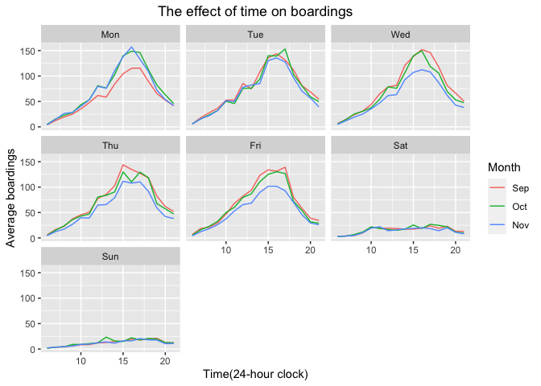

The graph tells the average boardings by day in September, October and
November, which is the technical fall semester at UT. During weekdays,
the hour of peaak boardings mainly focuses from 3-6 pm when students
finish all-day classes and prepare to go back home yet their
go-to-school time might be different so the hour of peak doesn’t
concentrate on a specific time window in the morning. During weekends,
there is no regular class so the number of boardings is smooth and
lower.

The reason why it looks lower for average boardings on Monday might be
because students are still adapting the regular pace of school after the
summer holiday. It is not uncommon that people have returning-to-school
synodrome. Students may miss and be unwiiling to start the class on
Monday in the first month of the semester.

Additionally, the boardings on Wednesdays, Thursday and Fridays is lower
in November when it approaches the end of the semester. Students have to
strugle into preparation for final exams and they typically have their
own study plans. Instead of attending regular classes they may choose to
study at home.

\#\#Panel 2

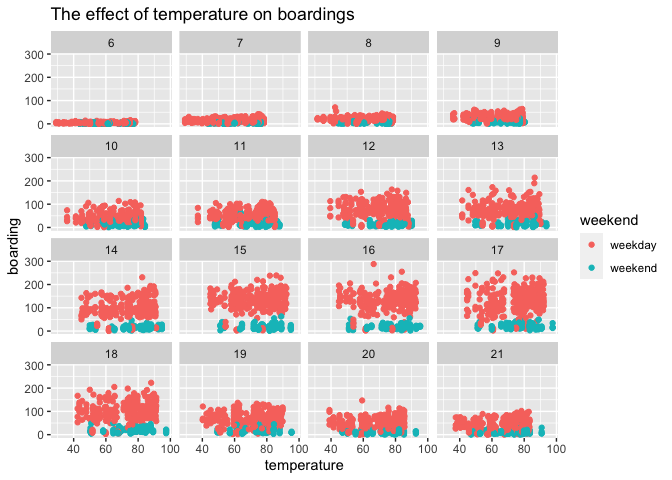
The graph shows the effect of the temperature in each 15-minute window
on the number of UT students riding the bus.

Holding hour of day and the weekend status constant, there is no effect
of temperature on boardings, which means the decision for riding a bus
more depends on other effect such as the class schedule instead of the
temeprature. The senerio takes place partly because of airconditioning
system in the bus ease the impact of temperature due to the natural
weather.

\#Question 2

\#Splitting the data

    ##                 price     lotSize         age   landValue livingArea
    ## price       1.0000000  0.15833257 -0.18879259  0.58126553  0.7123902
    ## lotSize     0.1583326  1.00000000 -0.01635219  0.05922184  0.1634499
    ## age        -0.1887926 -0.01635219  1.00000000 -0.02181790 -0.1742420
    ## landValue   0.5812655  0.05922184 -0.02181790  1.00000000  0.4234408
    ## livingArea  0.7123902  0.16344987 -0.17424195  0.42344081  1.0000000
    ## pctCollege  0.2001188 -0.03314779 -0.03778492  0.22842733  0.2099813
    ## bedrooms    0.4003487  0.11398209  0.02712480  0.20244922  0.6561957
    ## fireplaces  0.3767862  0.08522648 -0.17202234  0.21172745  0.4737878
    ## bathrooms   0.5972498  0.08482317 -0.36189725  0.29749779  0.7185637
    ## rooms       0.5311701  0.13760422 -0.08226402  0.29886515  0.7336658
    ##             pctCollege  bedrooms  fireplaces   bathrooms       rooms
    ## price       0.20011876 0.4003487  0.37678621  0.59724983  0.53117012
    ## lotSize    -0.03314779 0.1139821  0.08522648  0.08482317  0.13760422
    ## age        -0.03778492 0.0271248 -0.17202234 -0.36189725 -0.08226402
    ## landValue   0.22842733 0.2024492  0.21172745  0.29749779  0.29886515
    ## livingArea  0.20998127 0.6561957  0.47378781  0.71856368  0.73366584
    ## pctCollege  1.00000000 0.1629190  0.24662648  0.17954091  0.15706779
    ## bedrooms    0.16291896 1.0000000  0.28447487  0.45803313  0.67186325
    ## fireplaces  0.24662648 0.2844749  1.00000000  0.43623403  0.31989415
    ## bathrooms   0.17954091 0.4580331  0.43623403  1.00000000  0.51758469
    ## rooms       0.15706779 0.6718633  0.31989415  0.51758469  1.00000000

\#lm
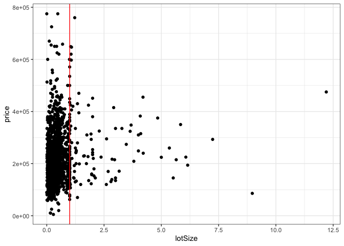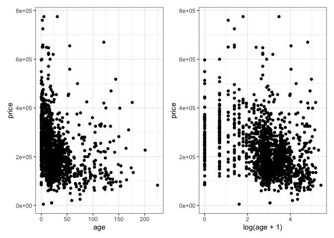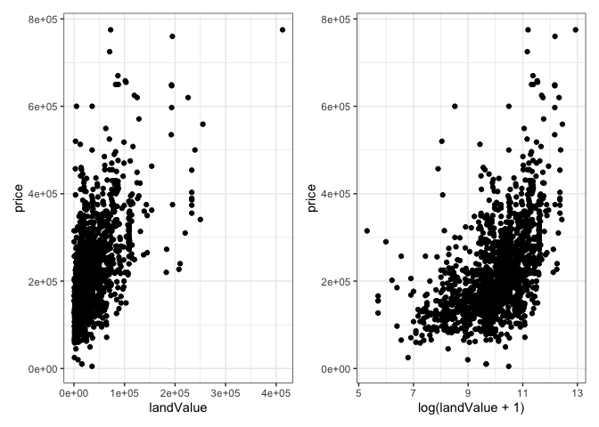

    ## [1] 0.5812655

    ## [1] 0.5016457

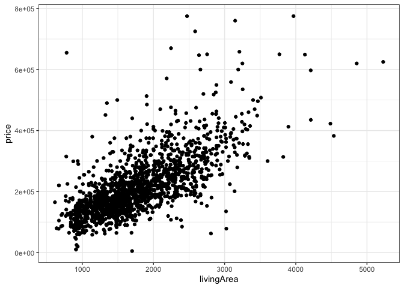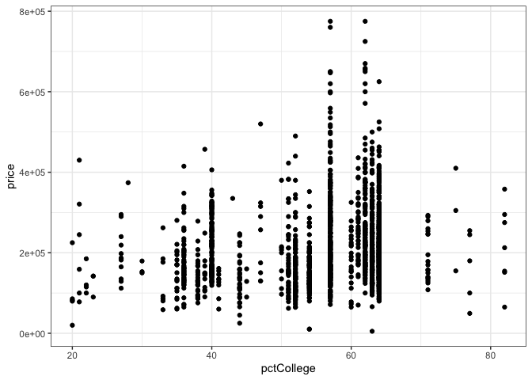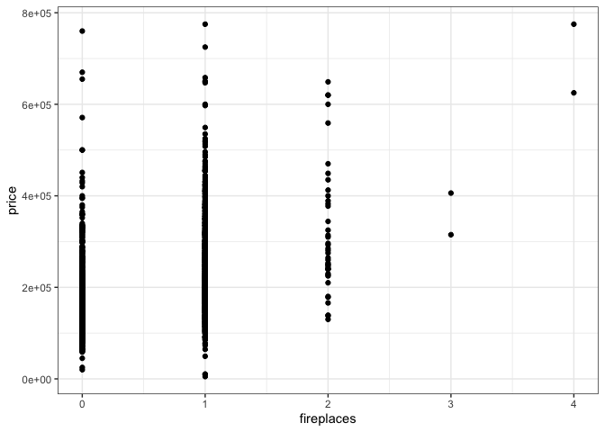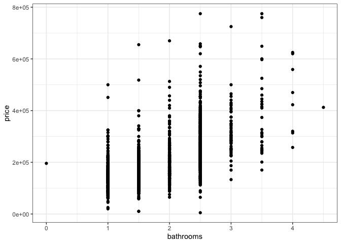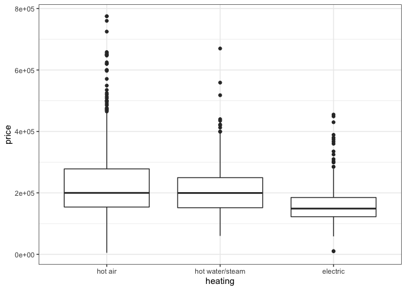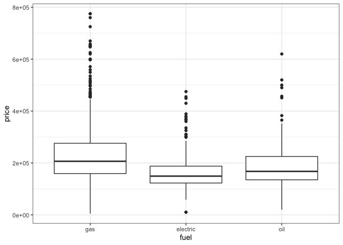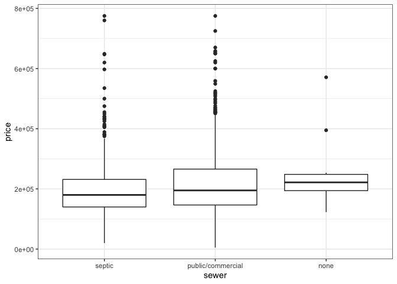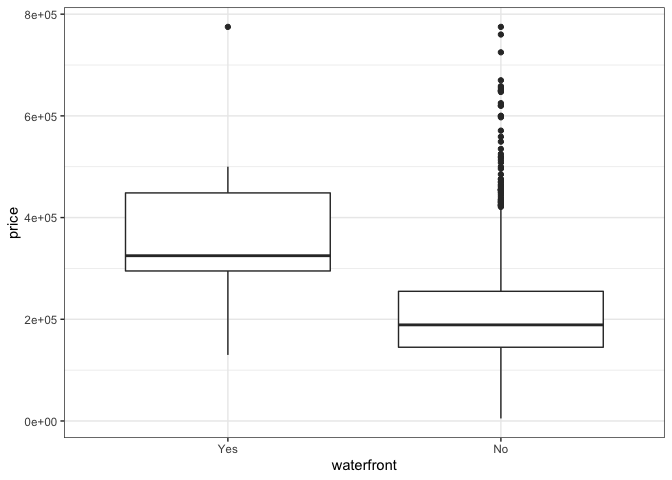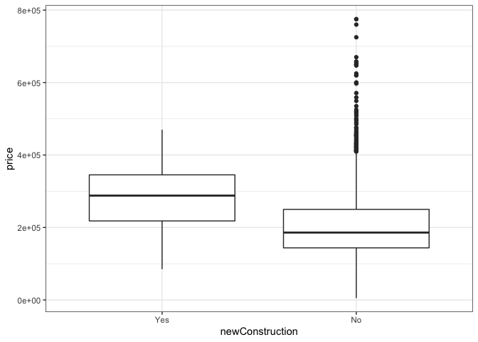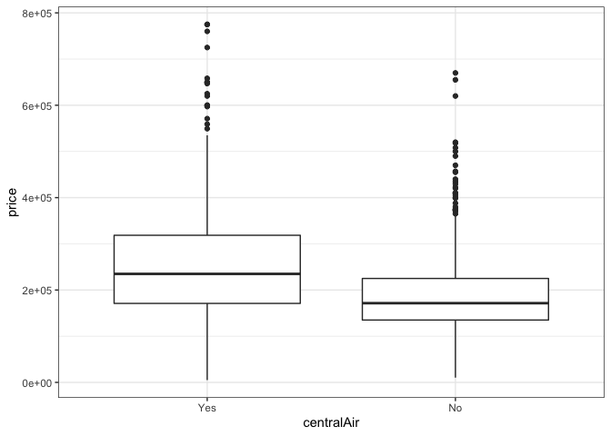

    ## 
    ## Call:
    ## lm(formula = price ~ lotSize + age + livingArea + pctCollege + 
    ##     bedrooms + fireplaces + bathrooms + rooms + heating + fuel + 
    ##     centralAir, data = SaratogaHouses)
    ## 
    ## Residuals:
    ##     Min      1Q  Median      3Q     Max 
    ## -232296  -40021   -7679   28919  527748 
    ## 
    ## Coefficients:
    ##                          Estimate Std. Error t value Pr(>|t|)    
    ## (Intercept)             28627.732  12224.396   2.342 0.019302 *  
    ## lotSize                  9350.452   2421.118   3.862 0.000117 ***
    ## age                        47.547     65.149   0.730 0.465600    
    ## livingArea                 91.870      5.033  18.253  < 2e-16 ***
    ## pctCollege                296.508    165.531   1.791 0.073428 .  
    ## bedrooms               -15630.719   2885.084  -5.418 6.89e-08 ***
    ## fireplaces                985.061   3385.478   0.291 0.771112    
    ## bathrooms               22006.971   3821.764   5.758 1.00e-08 ***
    ## rooms                    3259.119   1093.631   2.980 0.002922 ** 
    ## heatinghot water/steam  -9429.795   4738.934  -1.990 0.046765 *  
    ## heatingelectric         -3609.986  14009.898  -0.258 0.796689    
    ## fuelelectric           -12094.122  13792.538  -0.877 0.380686    
    ## fueloil                 -8873.140   5395.649  -1.644 0.100257    
    ## centralAirNo           -17112.819   3922.489  -4.363 1.36e-05 ***
    ## ---
    ## Signif. codes:  0 '***' 0.001 '**' 0.01 '*' 0.05 '.' 0.1 ' ' 1
    ## 
    ## Residual standard error: 66280 on 1714 degrees of freedom
    ## Multiple R-squared:   0.55,  Adjusted R-squared:  0.5466 
    ## F-statistic: 161.2 on 13 and 1714 DF,  p-value: < 2.2e-16

    ## 
    ## Call:
    ## lm(formula = price ~ I(lotSize > 1) + log(age + 1) + landValue + 
    ##     livingArea + pctCollege + bedrooms + bathrooms + I(heating == 
    ##     "electric") + fuel + waterfront + newConstruction + centralAir, 
    ##     data = SaratogaHouses)
    ## 
    ## Residuals:
    ##     Min      1Q  Median      3Q     Max 
    ## -236612  -34347   -4431   27416  468600 
    ## 
    ## Coefficients:
    ##                                Estimate Std. Error t value Pr(>|t|)    
    ## (Intercept)                   1.217e+05  1.939e+04   6.278 4.34e-10 ***
    ## I(lotSize > 1)TRUE            2.436e+04  6.650e+03   3.663 0.000257 ***
    ## log(age + 1)                 -8.472e+03  1.720e+03  -4.925 9.23e-07 ***
    ## landValue                     9.107e-01  4.711e-02  19.330  < 2e-16 ***
    ## livingArea                    7.482e+01  4.126e+00  18.134  < 2e-16 ***
    ## pctCollege                   -2.954e+01  1.495e+02  -0.198 0.843408    
    ## bedrooms                     -4.095e+03  2.391e+03  -1.713 0.086912 .  
    ## bathrooms                     2.002e+04  3.336e+03   6.001 2.38e-09 ***
    ## I(heating == "electric")TRUE -3.001e+02  1.225e+04  -0.025 0.980454    
    ## fuelelectric                 -7.804e+03  1.207e+04  -0.647 0.517941    
    ## fueloil                      -2.637e+03  4.755e+03  -0.555 0.579182    
    ## waterfrontNo                 -1.194e+05  1.552e+04  -7.695 2.38e-14 ***
    ## newConstructionNo             5.728e+04  7.993e+03   7.167 1.14e-12 ***
    ## centralAirNo                 -1.122e+04  3.297e+03  -3.403 0.000682 ***
    ## ---
    ## Signif. codes:  0 '***' 0.001 '**' 0.01 '*' 0.05 '.' 0.1 ' ' 1
    ## 
    ## Residual standard error: 58210 on 1714 degrees of freedom
    ## Multiple R-squared:  0.653,  Adjusted R-squared:  0.6504 
    ## F-statistic: 248.1 on 13 and 1714 DF,  p-value: < 2.2e-16

    ## Start:  AIC=37932.35
    ## price ~ I(lotSize > 1) + log(age + 1) + landValue + livingArea + 
    ##     pctCollege + bedrooms + bathrooms + I(heating == "electric") + 
    ##     fuel + waterfront + newConstruction + centralAir
    ## 
    ##                            Df  Sum of Sq        RSS   AIC
    ## - fuel                      2 2.3340e+09 5.8095e+12 37929
    ## - I(heating == "electric")  1 2.0342e+06 5.8071e+12 37930
    ## - pctCollege                1 1.3224e+08 5.8073e+12 37930
    ## <none>                                   5.8071e+12 37932
    ## - bedrooms                  1 9.9406e+09 5.8171e+12 37933
    ## - centralAir                1 3.9233e+10 5.8464e+12 37942
    ## - I(lotSize > 1)            1 4.5461e+10 5.8526e+12 37944
    ## - log(age + 1)              1 8.2195e+10 5.8893e+12 37955
    ## - bathrooms                 1 1.2202e+11 5.9291e+12 37966
    ## - newConstruction           1 1.7402e+11 5.9811e+12 37981
    ## - waterfront                1 2.0060e+11 6.0077e+12 37989
    ## - livingArea                1 1.1142e+12 6.9213e+12 38234
    ## - landValue                 1 1.2660e+12 7.0731e+12 38271
    ## 
    ## Step:  AIC=37929.04
    ## price ~ I(lotSize > 1) + log(age + 1) + landValue + livingArea + 
    ##     pctCollege + bedrooms + bathrooms + I(heating == "electric") + 
    ##     waterfront + newConstruction + centralAir
    ## 
    ##                            Df  Sum of Sq        RSS   AIC
    ## - pctCollege                1 3.7990e+07 5.8095e+12 37927
    ## <none>                                   5.8095e+12 37929
    ## - bedrooms                  1 9.4601e+09 5.8189e+12 37930
    ## - I(heating == "electric")  1 1.1822e+10 5.8213e+12 37931
    ## - centralAir                1 3.9775e+10 5.8492e+12 37939
    ## - I(lotSize > 1)            1 4.4821e+10 5.8543e+12 37940
    ## - log(age + 1)              1 8.7972e+10 5.8974e+12 37953
    ## - bathrooms                 1 1.2364e+11 5.9331e+12 37963
    ## - newConstruction           1 1.7430e+11 5.9838e+12 37978
    ## - waterfront                1 2.0022e+11 6.0097e+12 37986
    ## - livingArea                1 1.1158e+12 6.9253e+12 38231
    ## - landValue                 1 1.2889e+12 7.0984e+12 38273
    ## 
    ## Step:  AIC=37927.05
    ## price ~ I(lotSize > 1) + log(age + 1) + landValue + livingArea + 
    ##     bedrooms + bathrooms + I(heating == "electric") + waterfront + 
    ##     newConstruction + centralAir
    ## 
    ##                            Df  Sum of Sq        RSS   AIC
    ## <none>                                   5.8095e+12 37927
    ## - bedrooms                  1 9.5259e+09 5.8190e+12 37928
    ## - I(heating == "electric")  1 1.1814e+10 5.8213e+12 37929
    ## - centralAir                1 4.0713e+10 5.8502e+12 37937
    ## - I(lotSize > 1)            1 4.5852e+10 5.8554e+12 37939
    ## - log(age + 1)              1 8.9066e+10 5.8986e+12 37951
    ## - bathrooms                 1 1.2370e+11 5.9332e+12 37961
    ## - newConstruction           1 1.7664e+11 5.9861e+12 37977
    ## - waterfront                1 2.0382e+11 6.0133e+12 37985
    ## - livingArea                1 1.1178e+12 6.9273e+12 38229
    ## - landValue                 1 1.3309e+12 7.1404e+12 38281

    ## 
    ## Call:
    ## lm(formula = price ~ I(lotSize > 1) + log(age + 1) + landValue + 
    ##     livingArea + bedrooms + bathrooms + I(heating == "electric") + 
    ##     waterfront + newConstruction + centralAir, data = SaratogaHouses)
    ## 
    ## Residuals:
    ##     Min      1Q  Median      3Q     Max 
    ## -236579  -34198   -4563   27286  468965 
    ## 
    ## Coefficients:
    ##                                Estimate Std. Error t value Pr(>|t|)    
    ## (Intercept)                   1.195e+05  1.869e+04   6.392 2.10e-10 ***
    ## I(lotSize > 1)TRUE            2.348e+04  6.378e+03   3.681 0.000239 ***
    ## log(age + 1)                 -8.659e+03  1.688e+03  -5.131 3.21e-07 ***
    ## landValue                     9.126e-01  4.602e-02  19.833  < 2e-16 ***
    ## livingArea                    7.471e+01  4.110e+00  18.176  < 2e-16 ***
    ## bedrooms                     -3.999e+03  2.383e+03  -1.678 0.093546 .  
    ## bathrooms                     2.002e+04  3.310e+03   6.046 1.81e-09 ***
    ## I(heating == "electric")TRUE -7.281e+03  3.897e+03  -1.869 0.061845 .  
    ## waterfrontNo                 -1.189e+05  1.531e+04  -7.761 1.43e-14 ***
    ## newConstructionNo             5.718e+04  7.914e+03   7.225 7.48e-13 ***
    ## centralAirNo                 -1.120e+04  3.229e+03  -3.469 0.000536 ***
    ## ---
    ## Signif. codes:  0 '***' 0.001 '**' 0.01 '*' 0.05 '.' 0.1 ' ' 1
    ## 
    ## Residual standard error: 58170 on 1717 degrees of freedom
    ## Multiple R-squared:  0.6529, Adjusted R-squared:  0.6508 
    ## F-statistic: 322.9 on 10 and 1717 DF,  p-value: < 2.2e-16

    ## 
    ## Call:
    ## lm(formula = price ~ I(lotSize > 1) + log(age + 1) + landValue + 
    ##     +I(landValue^2) + livingArea + bedrooms + bathrooms + rooms + 
    ##     I(heating == "electric") + waterfront + newConstruction + 
    ##     centralAir + livingArea:centralAir + I(lotSize > 1):I(heating == 
    ##     "electric"), data = SaratogaHouses)
    ## 
    ## Residuals:
    ##     Min      1Q  Median      3Q     Max 
    ## -238341  -34328   -4460   28161  450619 
    ## 
    ## Coefficients:
    ##                                                   Estimate Std. Error t value
    ## (Intercept)                                      8.834e+04  1.921e+04   4.598
    ## I(lotSize > 1)TRUE                               1.176e+04  6.948e+03   1.693
    ## log(age + 1)                                    -8.312e+03  1.663e+03  -4.999
    ## landValue                                        1.067e+00  8.558e-02  12.467
    ## I(landValue^2)                                  -1.100e-06  3.972e-07  -2.769
    ## livingArea                                       8.545e+01  5.242e+00  16.303
    ## bedrooms                                        -6.421e+03  2.523e+03  -2.545
    ## bathrooms                                        2.066e+04  3.260e+03   6.337
    ## rooms                                            2.806e+03  9.446e+02   2.970
    ## I(heating == "electric")TRUE                    -1.143e+04  3.952e+03  -2.892
    ## waterfrontNo                                    -1.257e+05  1.532e+04  -8.202
    ## newConstructionNo                                5.605e+04  7.793e+03   7.192
    ## centralAirNo                                     4.171e+04  9.339e+03   4.467
    ## livingArea:centralAirNo                         -2.874e+01  4.823e+00  -5.958
    ## I(lotSize > 1)TRUE:I(heating == "electric")TRUE  4.694e+04  1.628e+04   2.884
    ##                                                 Pr(>|t|)    
    ## (Intercept)                                     4.59e-06 ***
    ## I(lotSize > 1)TRUE                               0.09072 .  
    ## log(age + 1)                                    6.34e-07 ***
    ## landValue                                        < 2e-16 ***
    ## I(landValue^2)                                   0.00568 ** 
    ## livingArea                                       < 2e-16 ***
    ## bedrooms                                         0.01103 *  
    ## bathrooms                                       2.99e-10 ***
    ## rooms                                            0.00302 ** 
    ## I(heating == "electric")TRUE                     0.00387 ** 
    ## waterfrontNo                                    4.58e-16 ***
    ## newConstructionNo                               9.48e-13 ***
    ## centralAirNo                                    8.47e-06 ***
    ## livingArea:centralAirNo                         3.09e-09 ***
    ## I(lotSize > 1)TRUE:I(heating == "electric")TRUE  0.00397 ** 
    ## ---
    ## Signif. codes:  0 '***' 0.001 '**' 0.01 '*' 0.05 '.' 0.1 ' ' 1
    ## 
    ## Residual standard error: 57240 on 1713 degrees of freedom
    ## Multiple R-squared:  0.6646, Adjusted R-squared:  0.6619 
    ## F-statistic: 242.5 on 14 and 1713 DF,  p-value: < 2.2e-16

    ##     df      AIC
    ## lm0 15 43287.31
    ## lm1 15 42838.20
    ## lm2 12 42832.91
    ## lm3 16 42781.26

    ## Analysis of Variance Table
    ## 
    ## Model 1: price ~ lotSize + age + livingArea + pctCollege + bedrooms + 
    ##     fireplaces + bathrooms + rooms + heating + fuel + centralAir
    ## Model 2: price ~ I(lotSize > 1) + log(age + 1) + landValue + +I(landValue^2) + 
    ##     livingArea + bedrooms + bathrooms + rooms + I(heating == 
    ##     "electric") + waterfront + newConstruction + centralAir + 
    ##     livingArea:centralAir + I(lotSize > 1):I(heating == "electric")
    ##   Res.Df        RSS Df  Sum of Sq      F    Pr(>F)    
    ## 1   1714 7.5307e+12                                   
    ## 2   1713 5.6124e+12  1 1.9183e+12 585.51 < 2.2e-16 ***
    ## ---
    ## Signif. codes:  0 '***' 0.001 '**' 0.01 '*' 0.05 '.' 0.1 ' ' 1

    ## Analysis of Variance Table
    ## 
    ## Model 1: price ~ I(lotSize > 1) + log(age + 1) + landValue + livingArea + 
    ##     pctCollege + bedrooms + bathrooms + I(heating == "electric") + 
    ##     fuel + waterfront + newConstruction + centralAir
    ## Model 2: price ~ I(lotSize > 1) + log(age + 1) + landValue + +I(landValue^2) + 
    ##     livingArea + bedrooms + bathrooms + rooms + I(heating == 
    ##     "electric") + waterfront + newConstruction + centralAir + 
    ##     livingArea:centralAir + I(lotSize > 1):I(heating == "electric")
    ##   Res.Df        RSS Df  Sum of Sq      F    Pr(>F)    
    ## 1   1714 5.8071e+12                                   
    ## 2   1713 5.6124e+12  1 1.9474e+11 59.439 2.124e-14 ***
    ## ---
    ## Signif. codes:  0 '***' 0.001 '**' 0.01 '*' 0.05 '.' 0.1 ' ' 1

    ## Analysis of Variance Table
    ## 
    ## Model 1: price ~ I(lotSize > 1) + log(age + 1) + landValue + livingArea + 
    ##     bedrooms + bathrooms + I(heating == "electric") + waterfront + 
    ##     newConstruction + centralAir
    ## Model 2: price ~ I(lotSize > 1) + log(age + 1) + landValue + +I(landValue^2) + 
    ##     livingArea + bedrooms + bathrooms + rooms + I(heating == 
    ##     "electric") + waterfront + newConstruction + centralAir + 
    ##     livingArea:centralAir + I(lotSize > 1):I(heating == "electric")
    ##   Res.Df        RSS Df  Sum of Sq      F    Pr(>F)    
    ## 1   1717 5.8095e+12                                   
    ## 2   1713 5.6124e+12  4 1.9711e+11 15.041 4.345e-12 ***
    ## ---
    ## Signif. codes:  0 '***' 0.001 '**' 0.01 '*' 0.05 '.' 0.1 ' ' 1

    ## Start:  AIC=30723.26
    ## price ~ I(lotSize > 1) + log(age + 1) + landValue + livingArea + 
    ##     pctCollege + bedrooms + bathrooms + I(heating == "electric") + 
    ##     fuel + waterfront + newConstruction + centralAir
    ## 
    ##                            Df  Sum of Sq        RSS   AIC
    ## - fuel                      2 2.3178e+09 4.9472e+12 30720
    ## - pctCollege                1 2.0539e+07 4.9449e+12 30721
    ## - I(heating == "electric")  1 9.0077e+07 4.9450e+12 30721
    ## - bedrooms                  1 5.4295e+09 4.9503e+12 30723
    ## <none>                                   4.9449e+12 30723
    ## - I(lotSize > 1)            1 3.0979e+10 4.9759e+12 30730
    ## - centralAir                1 3.2533e+10 4.9774e+12 30730
    ## - bathrooms                 1 5.8830e+10 5.0037e+12 30738
    ## - log(age + 1)              1 7.3438e+10 5.0183e+12 30742
    ## - waterfront                1 8.9764e+10 5.0347e+12 30746
    ## - newConstruction           1 1.5000e+11 5.0949e+12 30763
    ## - landValue                 1 9.7660e+11 5.9215e+12 30973
    ## - livingArea                1 9.7669e+11 5.9216e+12 30973
    ## 
    ## Step:  AIC=30719.92
    ## price ~ I(lotSize > 1) + log(age + 1) + landValue + livingArea + 
    ##     pctCollege + bedrooms + bathrooms + I(heating == "electric") + 
    ##     waterfront + newConstruction + centralAir
    ## 
    ##                            Df  Sum of Sq        RSS   AIC
    ## - pctCollege                1 8.0380e+07 4.9473e+12 30718
    ## - bedrooms                  1 5.0528e+09 4.9523e+12 30719
    ## <none>                                   4.9472e+12 30720
    ## - I(heating == "electric")  1 9.5095e+09 4.9567e+12 30721
    ## - I(lotSize > 1)            1 3.1118e+10 4.9783e+12 30727
    ## - centralAir                1 3.3094e+10 4.9803e+12 30727
    ## - bathrooms                 1 5.8819e+10 5.0060e+12 30734
    ## - log(age + 1)              1 7.9297e+10 5.0265e+12 30740
    ## - waterfront                1 8.9637e+10 5.0369e+12 30743
    ## - newConstruction           1 1.5069e+11 5.0979e+12 30760
    ## - livingArea                1 9.8160e+11 5.9288e+12 30971
    ## - landValue                 1 9.9668e+11 5.9439e+12 30974
    ## 
    ## Step:  AIC=30717.94
    ## price ~ I(lotSize > 1) + log(age + 1) + landValue + livingArea + 
    ##     bedrooms + bathrooms + I(heating == "electric") + waterfront + 
    ##     newConstruction + centralAir
    ## 
    ##                            Df  Sum of Sq        RSS   AIC
    ## - bedrooms                  1 5.0055e+09 4.9523e+12 30717
    ## <none>                                   4.9473e+12 30718
    ## - I(heating == "electric")  1 9.5457e+09 4.9568e+12 30719
    ## - I(lotSize > 1)            1 3.1226e+10 4.9785e+12 30725
    ## - centralAir                1 3.4925e+10 4.9822e+12 30726
    ## - bathrooms                 1 5.9172e+10 5.0065e+12 30732
    ## - log(age + 1)              1 7.9366e+10 5.0267e+12 30738
    ## - waterfront                1 8.9893e+10 5.0372e+12 30741
    ## - newConstruction           1 1.5473e+11 5.1020e+12 30759
    ## - livingArea                1 9.8448e+11 5.9318e+12 30969
    ## - landValue                 1 1.0290e+12 5.9763e+12 30980
    ## 
    ## Step:  AIC=30717.35
    ## price ~ I(lotSize > 1) + log(age + 1) + landValue + livingArea + 
    ##     bathrooms + I(heating == "electric") + waterfront + newConstruction + 
    ##     centralAir
    ## 
    ##                            Df  Sum of Sq        RSS   AIC
    ## <none>                                   4.9523e+12 30717
    ## - I(heating == "electric")  1 7.8495e+09 4.9602e+12 30718
    ## - I(lotSize > 1)            1 3.2681e+10 4.9850e+12 30724
    ## - centralAir                1 3.8715e+10 4.9910e+12 30726
    ## - bathrooms                 1 5.6977e+10 5.0093e+12 30731
    ## - log(age + 1)              1 9.1672e+10 5.0440e+12 30741
    ## - waterfront                1 9.2258e+10 5.0446e+12 30741
    ## - newConstruction           1 1.5929e+11 5.1116e+12 30760
    ## - landValue                 1 1.0478e+12 6.0001e+12 30983
    ## - livingArea                1 1.2445e+12 6.1968e+12 31028
    ## Start:  AIC=30014.67
    ## price ~ I(lotSize > 1) + log(age + 1) + landValue + livingArea + 
    ##     pctCollege + bedrooms + bathrooms + I(heating == "electric") + 
    ##     fuel + waterfront + newConstruction + centralAir
    ## 
    ##                            Df  Sum of Sq        RSS   AIC
    ## - fuel                      2 2.5061e+09 4.7430e+12 30011
    ## - pctCollege                1 4.8961e+07 4.7406e+12 30013
    ## - I(heating == "electric")  1 1.2603e+08 4.7406e+12 30013
    ## <none>                                   4.7405e+12 30015
    ## - bedrooms                  1 8.9394e+09 4.7494e+12 30015
    ## - centralAir                1 2.9312e+10 4.7698e+12 30021
    ## - I(lotSize > 1)            1 3.5684e+10 4.7762e+12 30023
    ## - log(age + 1)              1 6.7793e+10 4.8083e+12 30032
    ## - bathrooms                 1 1.2012e+11 4.8606e+12 30047
    ## - waterfront                1 1.3666e+11 4.8772e+12 30052
    ## - newConstruction           1 1.6401e+11 4.9045e+12 30059
    ## - livingArea                1 8.8282e+11 5.6233e+12 30246
    ## - landValue                 1 1.0059e+12 5.7464e+12 30275
    ## 
    ## Step:  AIC=30011.39
    ## price ~ I(lotSize > 1) + log(age + 1) + landValue + livingArea + 
    ##     pctCollege + bedrooms + bathrooms + I(heating == "electric") + 
    ##     waterfront + newConstruction + centralAir
    ## 
    ##                            Df  Sum of Sq        RSS   AIC
    ## - pctCollege                1 2.1805e+06 4.7430e+12 30009
    ## <none>                                   4.7430e+12 30011
    ## - I(heating == "electric")  1 7.5916e+09 4.7506e+12 30012
    ## - bedrooms                  1 8.4766e+09 4.7515e+12 30012
    ## - centralAir                1 2.9311e+10 4.7723e+12 30018
    ## - I(lotSize > 1)            1 3.5567e+10 4.7786e+12 30020
    ## - log(age + 1)              1 7.2044e+10 4.8151e+12 30030
    ## - bathrooms                 1 1.2149e+11 4.8645e+12 30044
    ## - waterfront                1 1.3679e+11 4.8798e+12 30048
    ## - newConstruction           1 1.6381e+11 4.9068e+12 30056
    ## - livingArea                1 8.8379e+11 5.6268e+12 30243
    ## - landValue                 1 1.0229e+12 5.7659e+12 30276
    ## 
    ## Step:  AIC=30009.39
    ## price ~ I(lotSize > 1) + log(age + 1) + landValue + livingArea + 
    ##     bedrooms + bathrooms + I(heating == "electric") + waterfront + 
    ##     newConstruction + centralAir
    ## 
    ##                            Df  Sum of Sq        RSS   AIC
    ## <none>                                   4.7430e+12 30009
    ## - I(heating == "electric")  1 7.5964e+09 4.7506e+12 30010
    ## - bedrooms                  1 8.5172e+09 4.7515e+12 30010
    ## - centralAir                1 3.0083e+10 4.7731e+12 30016
    ## - I(lotSize > 1)            1 3.6186e+10 4.7792e+12 30018
    ## - log(age + 1)              1 7.2909e+10 4.8159e+12 30028
    ## - bathrooms                 1 1.2177e+11 4.8648e+12 30042
    ## - waterfront                1 1.3921e+11 4.8822e+12 30047
    ## - newConstruction           1 1.6672e+11 4.9097e+12 30054
    ## - livingArea                1 8.8572e+11 5.6287e+12 30241
    ## - landValue                 1 1.0671e+12 5.8101e+12 30284
    ## Start:  AIC=30474.83
    ## price ~ I(lotSize > 1) + log(age + 1) + landValue + livingArea + 
    ##     pctCollege + bedrooms + bathrooms + I(heating == "electric") + 
    ##     fuel + waterfront + newConstruction + centralAir
    ## 
    ##                            Df  Sum of Sq        RSS   AIC
    ## - fuel                      2 2.8987e+09 4.8123e+12 30472
    ## - I(heating == "electric")  1 2.0983e+07 4.8094e+12 30473
    ## - pctCollege                1 5.0607e+07 4.8094e+12 30473
    ## - bedrooms                  1 4.5338e+09 4.8139e+12 30474
    ## <none>                                   4.8094e+12 30475
    ## - centralAir                1 3.2487e+10 4.8419e+12 30482
    ## - I(lotSize > 1)            1 5.2244e+10 4.8616e+12 30488
    ## - log(age + 1)              1 5.2621e+10 4.8620e+12 30488
    ## - bathrooms                 1 9.3246e+10 4.9026e+12 30499
    ## - newConstruction           1 1.0898e+11 4.9183e+12 30504
    ## - waterfront                1 1.9563e+11 5.0050e+12 30528
    ## - livingArea                1 8.2637e+11 5.6357e+12 30693
    ## - landValue                 1 1.1712e+12 5.9806e+12 30775
    ## 
    ## Step:  AIC=30471.66
    ## price ~ I(lotSize > 1) + log(age + 1) + landValue + livingArea + 
    ##     pctCollege + bedrooms + bathrooms + I(heating == "electric") + 
    ##     waterfront + newConstruction + centralAir
    ## 
    ##                            Df  Sum of Sq        RSS   AIC
    ## - pctCollege                1 3.8710e+03 4.8123e+12 30470
    ## - bedrooms                  1 4.0892e+09 4.8164e+12 30471
    ## - I(heating == "electric")  1 5.9601e+09 4.8182e+12 30471
    ## <none>                                   4.8123e+12 30472
    ## - centralAir                1 3.3513e+10 4.8458e+12 30479
    ## - I(lotSize > 1)            1 4.9838e+10 4.8621e+12 30484
    ## - log(age + 1)              1 5.7411e+10 4.8697e+12 30486
    ## - bathrooms                 1 9.5923e+10 4.9082e+12 30497
    ## - newConstruction           1 1.0927e+11 4.9215e+12 30501
    ## - waterfront                1 1.9373e+11 5.0060e+12 30524
    ## - livingArea                1 8.2526e+11 5.6375e+12 30689
    ## - landValue                 1 1.2005e+12 6.0128e+12 30778
    ## 
    ## Step:  AIC=30469.66
    ## price ~ I(lotSize > 1) + log(age + 1) + landValue + livingArea + 
    ##     bedrooms + bathrooms + I(heating == "electric") + waterfront + 
    ##     newConstruction + centralAir
    ## 
    ##                            Df  Sum of Sq        RSS   AIC
    ## - bedrooms                  1 4.0967e+09 4.8164e+12 30469
    ## - I(heating == "electric")  1 5.9649e+09 4.8182e+12 30469
    ## <none>                                   4.8123e+12 30470
    ## - centralAir                1 3.4599e+10 4.8469e+12 30478
    ## - I(lotSize > 1)            1 5.0589e+10 4.8629e+12 30482
    ## - log(age + 1)              1 5.7815e+10 4.8701e+12 30484
    ## - bathrooms                 1 9.6024e+10 4.9083e+12 30495
    ## - newConstruction           1 1.1121e+11 4.9235e+12 30499
    ## - waterfront                1 1.9721e+11 5.0095e+12 30523
    ## - livingArea                1 8.2734e+11 5.6396e+12 30688
    ## - landValue                 1 1.2401e+12 6.0524e+12 30786
    ## 
    ## Step:  AIC=30468.84
    ## price ~ I(lotSize > 1) + log(age + 1) + landValue + livingArea + 
    ##     bathrooms + I(heating == "electric") + waterfront + newConstruction + 
    ##     centralAir
    ## 
    ##                            Df  Sum of Sq        RSS   AIC
    ## - I(heating == "electric")  1 4.6082e+09 4.8210e+12 30468
    ## <none>                                   4.8164e+12 30469
    ## - centralAir                1 3.8143e+10 4.8545e+12 30478
    ## - I(lotSize > 1)            1 5.1871e+10 4.8682e+12 30482
    ## - log(age + 1)              1 6.4429e+10 4.8808e+12 30485
    ## - bathrooms                 1 9.4068e+10 4.9104e+12 30494
    ## - newConstruction           1 1.1355e+11 4.9299e+12 30499
    ## - waterfront                1 2.0418e+11 5.0205e+12 30524
    ## - livingArea                1 1.0802e+12 5.8966e+12 30747
    ## - landValue                 1 1.2661e+12 6.0825e+12 30790
    ## 
    ## Step:  AIC=30468.17
    ## price ~ I(lotSize > 1) + log(age + 1) + landValue + livingArea + 
    ##     bathrooms + waterfront + newConstruction + centralAir
    ## 
    ##                   Df  Sum of Sq        RSS   AIC
    ## <none>                          4.8210e+12 30468
    ## - centralAir       1 4.1288e+10 4.8623e+12 30478
    ## - I(lotSize > 1)   1 5.0294e+10 4.8713e+12 30481
    ## - log(age + 1)     1 6.1927e+10 4.8829e+12 30484
    ## - bathrooms        1 9.5854e+10 4.9168e+12 30494
    ## - newConstruction  1 1.1151e+11 4.9325e+12 30498
    ## - waterfront       1 2.0327e+11 5.0242e+12 30523
    ## - livingArea       1 1.1131e+12 5.9340e+12 30754
    ## - landValue        1 1.2833e+12 6.1043e+12 30793
    ## Start:  AIC=30401.65
    ## price ~ I(lotSize > 1) + log(age + 1) + landValue + livingArea + 
    ##     pctCollege + bedrooms + bathrooms + I(heating == "electric") + 
    ##     fuel + waterfront + newConstruction + centralAir
    ## 
    ##                            Df  Sum of Sq        RSS   AIC
    ## - fuel                      2 3.0529e+09 4.2347e+12 30399
    ## - I(heating == "electric")  1 8.3507e+06 4.2317e+12 30400
    ## - pctCollege                1 3.0536e+07 4.2317e+12 30400
    ## - bedrooms                  1 1.2375e+09 4.2329e+12 30400
    ## <none>                                   4.2317e+12 30402
    ## - I(lotSize > 1)            1 2.2507e+10 4.2542e+12 30407
    ## - centralAir                1 3.3899e+10 4.2656e+12 30411
    ## - log(age + 1)              1 6.4166e+10 4.2958e+12 30421
    ## - bathrooms                 1 9.8747e+10 4.3304e+12 30432
    ## - newConstruction           1 1.0928e+11 4.3409e+12 30435
    ## - waterfront                1 1.5746e+11 4.3891e+12 30450
    ## - livingArea                1 8.0496e+11 5.0366e+12 30642
    ## - landValue                 1 1.0431e+12 5.2747e+12 30706
    ## 
    ## Step:  AIC=30398.65
    ## price ~ I(lotSize > 1) + log(age + 1) + landValue + livingArea + 
    ##     pctCollege + bedrooms + bathrooms + I(heating == "electric") + 
    ##     waterfront + newConstruction + centralAir
    ## 
    ##                            Df  Sum of Sq        RSS   AIC
    ## - pctCollege                1 6.0640e+03 4.2347e+12 30397
    ## - bedrooms                  1 1.0270e+09 4.2357e+12 30397
    ## <none>                                   4.2347e+12 30399
    ## - I(heating == "electric")  1 1.1490e+10 4.2462e+12 30400
    ## - I(lotSize > 1)            1 2.0676e+10 4.2554e+12 30403
    ## - centralAir                1 3.4544e+10 4.2693e+12 30408
    ## - log(age + 1)              1 6.8879e+10 4.3036e+12 30419
    ## - bathrooms                 1 1.0053e+11 4.3352e+12 30429
    ## - newConstruction           1 1.0907e+11 4.3438e+12 30432
    ## - waterfront                1 1.5642e+11 4.3911e+12 30447
    ## - livingArea                1 8.0517e+11 5.0399e+12 30639
    ## - landValue                 1 1.0627e+12 5.2974e+12 30708
    ## 
    ## Step:  AIC=30396.65
    ## price ~ I(lotSize > 1) + log(age + 1) + landValue + livingArea + 
    ##     bedrooms + bathrooms + I(heating == "electric") + waterfront + 
    ##     newConstruction + centralAir
    ## 
    ##                            Df  Sum of Sq        RSS   AIC
    ## - bedrooms                  1 1.0273e+09 4.2357e+12 30395
    ## <none>                                   4.2347e+12 30397
    ## - I(heating == "electric")  1 1.1490e+10 4.2462e+12 30398
    ## - I(lotSize > 1)            1 2.0989e+10 4.2557e+12 30402
    ## - centralAir                1 3.5893e+10 4.2706e+12 30406
    ## - log(age + 1)              1 6.9649e+10 4.3044e+12 30417
    ## - bathrooms                 1 1.0069e+11 4.3354e+12 30427
    ## - newConstruction           1 1.1084e+11 4.3455e+12 30431
    ## - waterfront                1 1.5928e+11 4.3940e+12 30446
    ## - livingArea                1 8.0902e+11 5.0437e+12 30638
    ## - landValue                 1 1.0995e+12 5.3342e+12 30716
    ## 
    ## Step:  AIC=30394.99
    ## price ~ I(lotSize > 1) + log(age + 1) + landValue + livingArea + 
    ##     bathrooms + I(heating == "electric") + waterfront + newConstruction + 
    ##     centralAir
    ## 
    ##                            Df  Sum of Sq        RSS   AIC
    ## <none>                                   4.2357e+12 30395
    ## - I(heating == "electric")  1 1.0752e+10 4.2465e+12 30396
    ## - I(lotSize > 1)            1 2.1375e+10 4.2571e+12 30400
    ## - centralAir                1 3.8059e+10 4.2738e+12 30405
    ## - log(age + 1)              1 7.4709e+10 4.3104e+12 30417
    ## - bathrooms                 1 9.9794e+10 4.3355e+12 30425
    ## - newConstruction           1 1.1151e+11 4.3472e+12 30429
    ## - waterfront                1 1.6352e+11 4.3993e+12 30446
    ## - livingArea                1 1.0784e+12 5.3141e+12 30708
    ## - landValue                 1 1.1127e+12 5.3485e+12 30717
    ## Start:  AIC=30110.73
    ## price ~ I(lotSize > 1) + log(age + 1) + landValue + livingArea + 
    ##     pctCollege + bedrooms + bathrooms + I(heating == "electric") + 
    ##     fuel + waterfront + newConstruction + centralAir
    ## 
    ##                            Df  Sum of Sq        RSS   AIC
    ## - fuel                      2 2.4973e+06 4.4315e+12 30107
    ## - pctCollege                1 8.5521e+08 4.4323e+12 30109
    ## - I(heating == "electric")  1 1.1762e+09 4.4327e+12 30109
    ## <none>                                   4.4315e+12 30111
    ## - centralAir                1 2.8547e+10 4.4600e+12 30118
    ## - bedrooms                  1 2.8814e+10 4.4603e+12 30118
    ## - I(lotSize > 1)            1 3.9354e+10 4.4708e+12 30121
    ## - log(age + 1)              1 7.3809e+10 4.5053e+12 30131
    ## - bathrooms                 1 1.2005e+11 4.5515e+12 30146
    ## - newConstruction           1 1.6870e+11 4.6002e+12 30160
    ## - waterfront                1 2.4003e+11 4.6715e+12 30181
    ## - landValue                 1 8.7705e+11 5.3085e+12 30357
    ## - livingArea                1 9.5432e+11 5.3858e+12 30377
    ## 
    ## Step:  AIC=30106.73
    ## price ~ I(lotSize > 1) + log(age + 1) + landValue + livingArea + 
    ##     pctCollege + bedrooms + bathrooms + I(heating == "electric") + 
    ##     waterfront + newConstruction + centralAir
    ## 
    ##                            Df  Sum of Sq        RSS   AIC
    ## - pctCollege                1 8.6184e+08 4.4324e+12 30105
    ## <none>                                   4.4315e+12 30107
    ## - I(heating == "electric")  1 1.3995e+10 4.4455e+12 30109
    ## - centralAir                1 2.8722e+10 4.4602e+12 30114
    ## - bedrooms                  1 2.8850e+10 4.4603e+12 30114
    ## - I(lotSize > 1)            1 4.2216e+10 4.4737e+12 30118
    ## - log(age + 1)              1 7.6265e+10 4.5078e+12 30128
    ## - bathrooms                 1 1.2103e+11 4.5525e+12 30142
    ## - newConstruction           1 1.6910e+11 4.6006e+12 30156
    ## - waterfront                1 2.4190e+11 4.6734e+12 30178
    ## - landValue                 1 8.8611e+11 5.3176e+12 30355
    ## - livingArea                1 9.5595e+11 5.3874e+12 30373
    ## 
    ## Step:  AIC=30105
    ## price ~ I(lotSize > 1) + log(age + 1) + landValue + livingArea + 
    ##     bedrooms + bathrooms + I(heating == "electric") + waterfront + 
    ##     newConstruction + centralAir
    ## 
    ##                            Df  Sum of Sq        RSS   AIC
    ## <none>                                   4.4324e+12 30105
    ## - I(heating == "electric")  1 1.4081e+10 4.4464e+12 30107
    ## - centralAir                1 2.7878e+10 4.4602e+12 30112
    ## - bedrooms                  1 2.9449e+10 4.4618e+12 30112
    ## - I(lotSize > 1)            1 4.4430e+10 4.4768e+12 30117
    ## - log(age + 1)              1 7.8474e+10 4.5108e+12 30127
    ## - bathrooms                 1 1.2031e+11 4.5527e+12 30140
    ## - newConstruction           1 1.6862e+11 4.6010e+12 30154
    ## - waterfront                1 2.4834e+11 4.6807e+12 30178
    ## - landValue                 1 9.0486e+11 5.3372e+12 30358
    ## - livingArea                1 9.5509e+11 5.3874e+12 30371

    ## [1] 66404.84 58435.54 58517.61 57668.94

    ## [1] 57668.94

\#knn

    ##    lotSize        age  landValue livingArea pctCollege   bedrooms fireplaces 
    ##  0.1583326 -0.1887926  0.5812655  0.7123902  0.2001188  0.4003487  0.3767862 
    ##  bathrooms      rooms      price 
    ##  0.5972498  0.5311701  1.0000000

    ## [1] 62197.64 62808.27 61826.31 63165.20

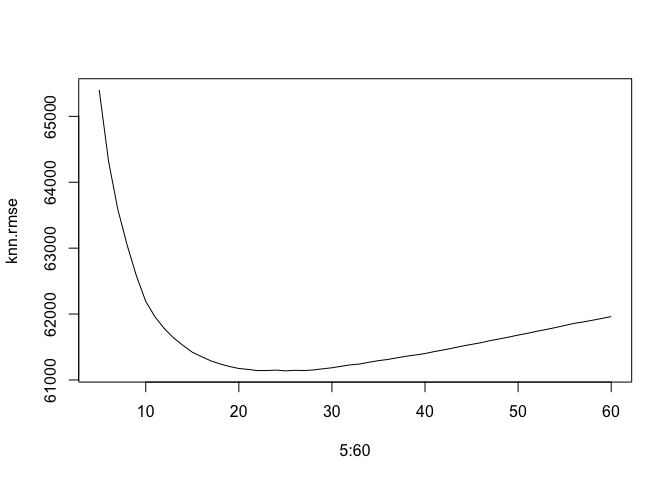

    ## [1] 61138.13

Report The lm RMSE is lower than the KNN RMSE and it has the better
illustration about the interaction of predictors.According to the data
from lm0 to lm3, the rmse of lm3 is smaller and it can illustrate how
different predictors can have effect on prices. From the coefficient of
lm1 to lm2, the transformation of age, I(heating == “electric”),
waterfront, and Central Value could decrease the price of one house. The
landvalue could increase the price of house, but the square of landvalue
could decrease the price. While, “lotSize &gt; 1”, “livingArea”, and
“bathrooms” these factors can promote the price. When increase one
element of these predictors, the price will increase. So maybe the tax
authority could focus on these predictors when evaluating the housing
price. In addition, the advantage of lm is that it has a simple
foundation of complicated techniques and it can be interpreted easily
than knn model. So when the RMSE of lm is lower than the RMSE of knn,
the tax authority could use the linear model to justify the change and
the error between predictors. Maybe it can be helpful to them
implemented the tax regulation.

\#Question 3

\#\#(1)

    ## 
    ##  0  1 
    ## 36 53

    ## 
    ##   0   1 
    ## 421 197

    ## 
    ##   0   1 
    ## 243  50

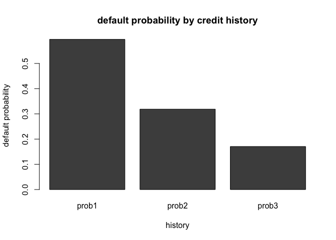

\#\#(2)

    ##         (Intercept)            duration              amount         installment 
    ##       -7.075258e-01        2.525834e-02        9.596288e-05        2.216019e-01 
    ##                 age         historypoor     historyterrible          purposeedu 
    ##       -2.018401e-02       -1.107586e+00       -1.884675e+00        7.247898e-01 
    ## purposegoods/repair       purposenewcar      purposeusedcar       foreigngerman 
    ##        1.049037e-01        8.544560e-01       -7.959260e-01       -1.264676e+00

After seeing the bar plot of history and the default probability, the
default probability is high when one borrower’s credit rating is
“good”.When borrowers’ credit rating is “poor” or “terrible”, the
default probabilty is lower than people who are “good”. This is
contradicted by my thinking because I think that people will experience
high default probability when their credit rating is “poor” or
“terrible”. Maybe one reason is that the bank check people whose credit
rating is poor or terrible more strictly. Another reason is the total
number of people of “poor” which met default and it has the large
proportion of total number of people who experience default. In my
opinion, this data is not appropriate for building the model of
predicting the default probabilty. One reason is that this regression
model might not consider the interaction between predictors. Maybe the
relationshipe beween “historypoor” and “purposegoods” will cause lower
default probability. Another reason is the bank matches the default and
the not default in similar set of loans. Maybe similar loans could cause
some errors of predictors of default probability. I advise that the
bank’s sampling scheme should be random sampling and choose different
loans to estimate default probabilities.

\#Question 4

\#\#Model building

\#\#\#Baseline 1

    ## [1] 0.9218576

The classification accuracy of baseline1 in the test set is 92.19%.

\#\#\#Baseline 2

    ## [1] 0.9364492

The classification accuracy of baseline2 in the test set is 93.64%.

\#\#\#The best linear model

    ## [1] 0.9378565

The classification accuracy of the best linear model in the test set is
93.78%.

\#\#Model validation: step 1

    ## 
    ## Call:
    ## roc.default(response = testw_pred, predictor = test_wai$children)
    ## 
    ## Data: test_wai$children in 4773 controls (testw_pred 0) < 226 cases (testw_pred 1).
    ## Area under the curve: 0.824

    ## Area under the curve: 0.824

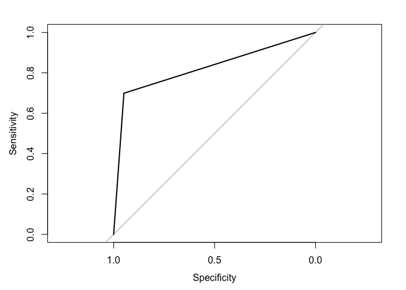

the ROC curve show below, and the AUC is 0.82, which means the best
model presented well in new data.

\#\#Model validation: step 2

From the result, we can see that the auc range from 0.7251 to 0.8859.
